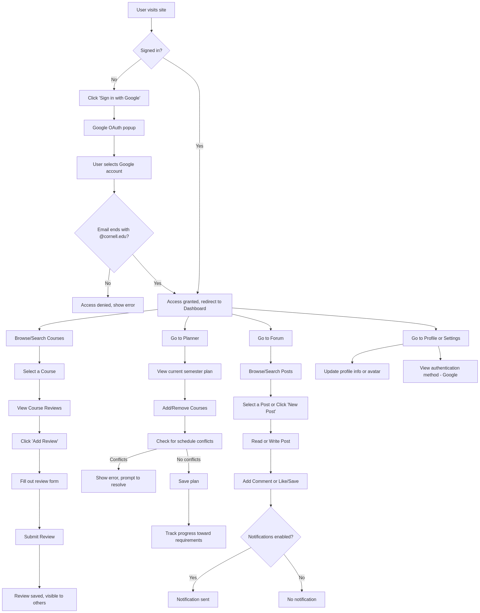
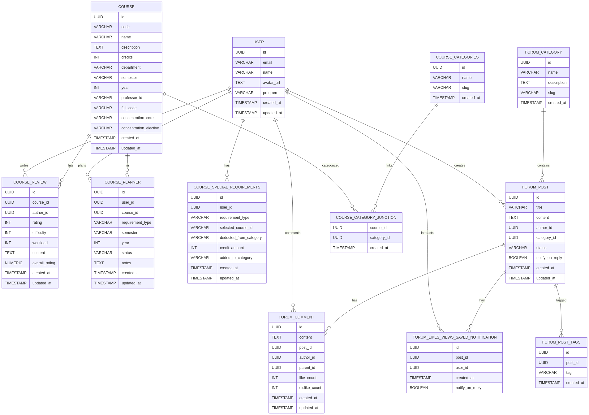

# Final Project Outline - BSS Project

## 1. Team Information

- Team Name: LaiCai
- Team Members:
    - Tianyin Zhang - tz445
    - Haoran Qin - hq67
    - Yining Xu - yx647
- Deployed Project URL: https://www.cornelltechhub.info/
- Source Code URL: https://github.com/TY37zhang/CornellTech_Hub

## 2. Project Idea

- Project Title: Cornell Tech Hub
- Project Description:

    A comprehensive web application designed specifically for Cornell Tech students to manage their academic journey. The platform serves as a centralized hub for course information, academic planning, peer discussions, and resource sharing. It features detailed course catalogs, program-specific requirements tracking, semester planning tools, and a community forum for academic discussions.

- Target Users: Cornell Tech Students and Alumni
- Core Functionality:

1. Course Management and Planning
    - Course review and rating system
    - Program-specific requirement tracking
    - Semester-by-semester course planning
    - Schedule management with conflict detection
2. Academic Resources
    - Course reviews and ratings
    - Study materials sharing
    - Program requirement guides
3. Community Features
    - Categorized forum system
    - Interactive post and comment functionality
    - User engagement tracking
    - Notification system

## 3. Prototypes & Planning

- Initial Sketches:  
  Instead of using traditional wireframing tools like Figma, we brainstormed the rough design and core functionality as a team. To quickly move from concept to implementation, we utilized Vercel’s v0.dev tool to generate [starter frontend code](https://v0.dev/chat/cornell-tech-project-Pnmbhrr3Rfl) based on our ideas. This approach allowed us to rapidly prototype the main pages and iterate on the UI directly in code, helping us visualize the user experience and make adjustments early in the development process.

- User Flow Diagrams:  
  We mapped out the primary user flows, such as signing in with Google, searching for courses, submitting reviews, planning semesters, and posting in the forum. These diagrams helped us identify and resolve potential UX issues early and ensured our backend and frontend plans covered all necessary features.

    

**Data Models:**

## 4. Technical Implementation

### Frontend/UI

- **Framework/Library:** Next.js 15.3.1 (App Router) with React 18.3.1 and TypeScript
- **Component Structure:**
    - **Shared Components:** Navbar, Footer, Sidebar, Cards, Buttons, Modals, Dialogs, Form elements, Toast notifications
    - **Page-Specific Components:**
        - Course Reviews: Review list, review form, rating display, filter/sort controls
        - Academic Planner: Planner grid, requirement tracker, drag-and-drop course assignment, semester selector
        - Forum: Post list, post detail, comment thread, like/save buttons, tag chips, category navigation
        - User Profile: Profile card, avatar upload, program display, settings
    - **Layout Components:** Responsive containers, grid layouts, flex layouts, section wrappers
- **State Management:**
    - React Context for global state (e.g., user session, theme)
    - Local state with React hooks for component-level logic
- **Form Handling & Validation:**
    - React Hook Form for form state management
    - Zod for schema validation
- **UI Libraries Used:**
    - Radix UI for accessible, unstyled primitives (dialogs, popovers, tabs, etc.)
    - Tailwind CSS for utility-first styling and responsive design
    - Framer Motion for smooth animations and transitions
    - Lucide React and Heroicons for iconography
- **Design System:**
    - Responsive design with custom breakpoints (not strictly mobile-first)
    - Consistent color palette and typography via Tailwind config
- **Other Features:**
    - Client-side routing and prefetching with Next.js
    - Image optimization via Next.js Image component
    - Analytics and performance monitoring with Vercel Analytics

### Backend/Server

- **Server Framework:** Next.js API Routes (serverless functions)
- **API Structure:**
    - **Authentication Endpoints:**
        - User sign-in/sign-up (NextAuth.js with .edu email restriction)
        - Session management and user profile retrieval
    - **Course Data Endpoints:**
        - Fetch all courses, fetch by program/department
        - Submit and retrieve course reviews
        - Course planner: add, update, remove planned courses
        - Requirement tracking and validation
    - **Forum Endpoints:**
        - Create, fetch, update, and delete forum posts
        - Post comments, like, save, and notification preferences
        - Category and tag management
    - **Academic Planner Endpoints:**
        - CRUD operations for user-specific semester plans
        - Requirement assignment and progress tracking
- **Database:** PostgreSQL (hosted on NeonDB)
    - Relational schema with normalized tables for users, courses, reviews, forum, planner, etc.
    - Data integrity enforced via foreign keys and constraints
- **Database Access:** Direct SQL queries using the @neondatabase/serverless driver
    - Custom SQL wrapper for querying the database (see lib/prisma.ts)
    - Manual mapping between application logic and SQL queries
    - No ORM is used; all CRUD operations are implemented with raw SQL
- **Third-party Integrations:**
    - **Cloudinary:** Image upload and hosting for user avatars and other media
    - **Resend:** Email notifications (e.g., for forum replies, account actions)
    - **NextAuth.js with Google OAuth:** Secure authentication and session management, restricted to Cornell Google accounts
- **Validation & Security:**
    - Input validation with Zod (where applicable)
    - Role-based access control for sensitive endpoints
    - Data encryption for authentication/session data
- **Other Features:**
    - API error handling and standardized response formats
    - Environment-based configuration for secrets and database URLs
    - Logging and monitoring via Vercel/NeonDB dashboards

## 5. Technology Choices

### Frontend Technologies

- Next.js 15.3.1 (for server-side rendering and routing)
- React 18.3.1 (for component-based UI)
- TypeScript (for type safety)
- Radix UI (for accessible components)
- Tailwind CSS (for utility-first styling)
- Framer Motion (for animations)
- React Hook Form (for form management)
- Zod (for validation)

### Backend Technologies

- Next.js API routes (for serverless functions)
- PostgreSQL (for relational data storage)
- NextAuth.js (for authentication)
- Cloudinary (for media storage)
- Resend (for email functionality)

### Development Tools

- ESLint (for code linting)
- TypeScript (for type safety)
- PostCSS (for CSS processing)
- Tailwind CSS (for styling)

## 6. Learnings

**Database Schema Design:**  
Designing our database schema was both a challenge and a valuable learning experience for our team. We needed to support a range of features—course reviews, academic planning, forum discussions, and user management—while ensuring data integrity and efficient queries. As a group, we spent significant time normalizing tables and defining clear relationships between users, courses, reviews, and planner entries. This process taught us the importance of planning for future features and scalability, as well as the value of enforcing data consistency through foreign keys and constraints.

**Switching from ORM to Raw SQL:**  
At the start, we intended to use Prisma ORM for database access. However, we ran into compatibility and deployment issues with serverless and edge environments. As a result, we decided to switch to direct SQL queries using the Neon serverless driver. This shift gave us more control and flexibility, but also required us to manually handle query construction, data mapping, and error handling. Working with raw SQL deepened our understanding of database operations and highlighted the trade-offs between the convenience of an ORM and the control of writing queries ourselves.

**Debugging Edge Cases in the Planner:**  
Building the academic planner feature surfaced several tricky edge cases for our team, such as handling overlapping course schedules, validating program requirements, and supporting updates to planned courses. Debugging these scenarios required us to thoroughly test our logic and ensure users couldn't create invalid plans or bypass requirements. Through this process, we learned the importance of robust validation, clear user feedback, and comprehensive test cases when developing complex, user-driven features.
